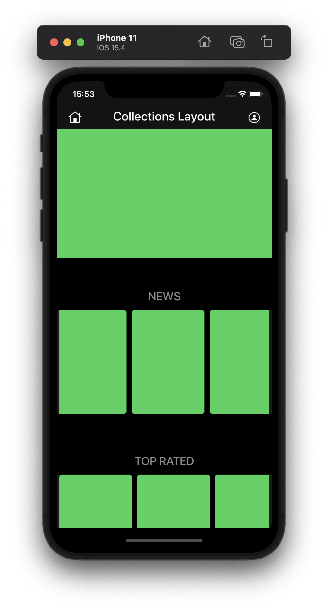
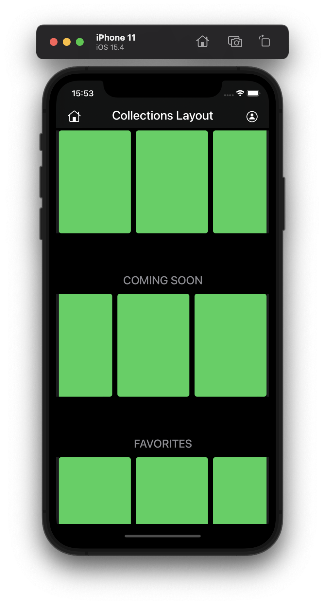

# collectionViewTraining

an app to pratic usage of multiple collections view inside a single table view

<table>
  <tbody>
    <tr>
      <td></td>
      <td></td>
    </tr>
  </tbody>
</table>

### Concepts used ###

- Swift
- UIKit and ViewCode
- NavigationViewController
- UICollectionView
- Custom UICollectionViewCell
- UITableView
- Custom UITableViewCell
